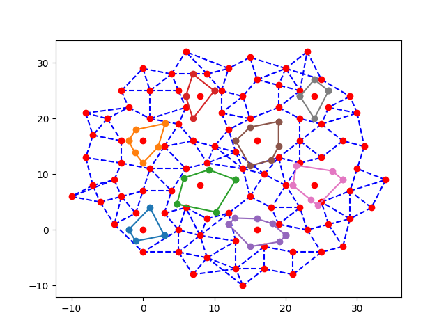

# robot-path-optimization

## Overview 
The project aimed to develop a graph-based algorithm for efficiently finding the shortest path to inspect 'n' points in a single-level warehouse using a robot. A Monte Carlo layout generator was created for testing, generating diverse warehouse layouts to evaluate the algorithm's performance.
## Features
* visualization of the operation of algorithms in the warehouse simulation
* support for multiple TSP solvers i.e. OR-Tools, LKH, Concorde, EAX GA
* layout generation that can be used for benchmarking and in the simulation

## Installable solvers
* [Concorde TSP](https://www.math.uwaterloo.ca/tsp/concorde/downloads/downloads.htm)
* [GA-for-TSP](https://github.com/lccasagrande/TSP-GA)
* [LKH](http://webhotel4.ruc.dk/~keld/research/LKH/)
* [OR-Tools](https://developers.google.com/optimization/install)
